# Phishing Simulation Lab – GoPhish + MailHog

A home lab I built to simulate phishing campaigns and demonstrate how social engineering attacks work in a controlled environment. This lab is part of my broader SOC home lab setup alongside my ELK SIEM lab.

## Why I built this
Understanding how phishing attacks work from the attacker's perspective is essential for a SOC Analyst. Detecting and responding to phishing requires knowing what indicators to look for — this lab helped me understand the full attack chain.

## What the lab includes
- GoPhish phishing simulation framework running in Docker
- MailHog local SMTP server for capturing emails without sending to real addresses
- Fake landing page capturing submitted credentials
- Campaign tracking — email opened, link clicked, credentials submitted

## Tech stack
- GoPhish
- MailHog
- Docker + Docker Compose
- Ubuntu Server 22.04

## How to run
```bash
git clone https://github.com/bluemzi/phishing-lab.git
cd phishing-lab
docker-compose up -d
```

## What I simulated
- Created a target group (Test Targets) with fake employees
- Sent a fake IT security alert warning about password expiry
- Built a fake Corporate Password Reset landing page
- Tracked who clicked the link and who submitted credentials

## What GoPhish tracked
- Email Sent
- Email Opened
- Link Clicked
- Credentials Submitted (username + password captured)

## Why this matters in a real SOC environment
In a real enterprise security assessment, this type of simulation is used to test employee awareness. Any user who clicked the link and submitted their credentials would be flagged and required to attend security awareness training. This is a standard practice in phishing resilience programs.

## Screenshots
### GoPhish Dashboard
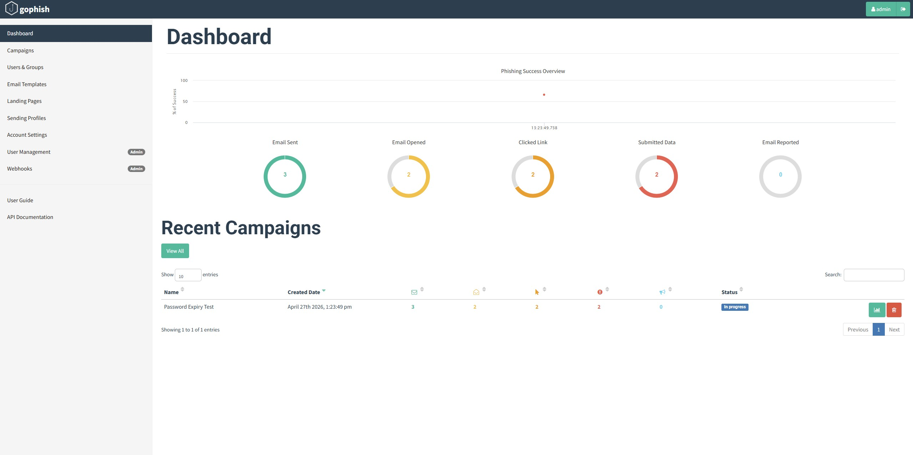

### Campaigns
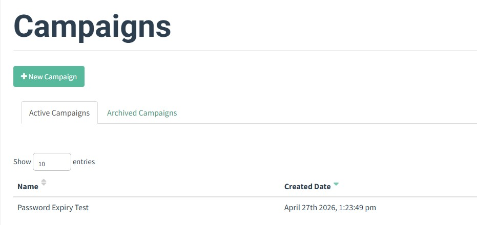

### Email Template
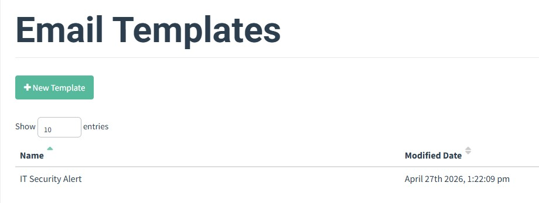

### Email Template Details
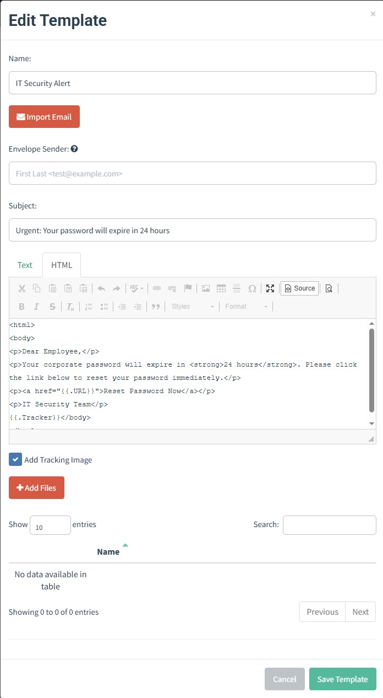

### Landing Pages
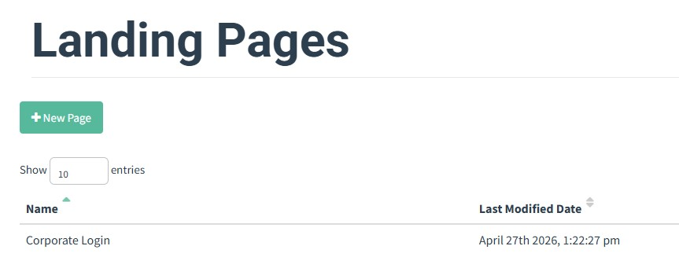

### Landing Page Details
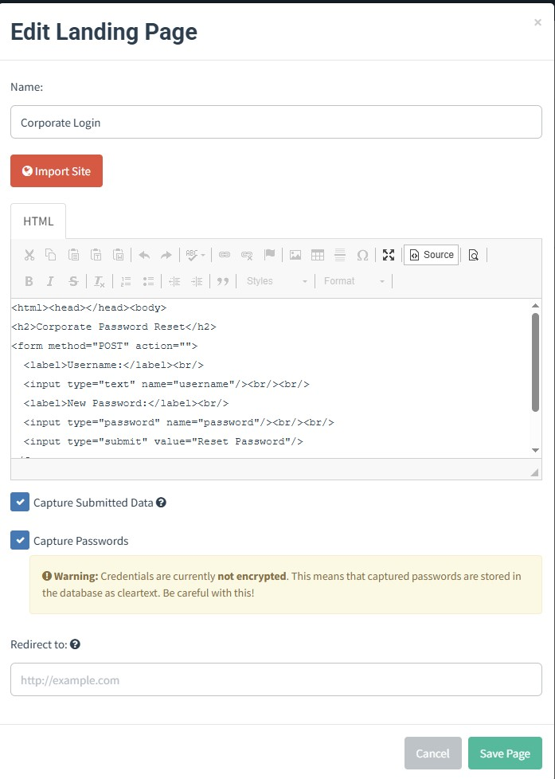

### Sending Profiles
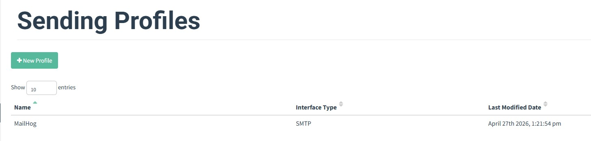

### Sending Profile Details
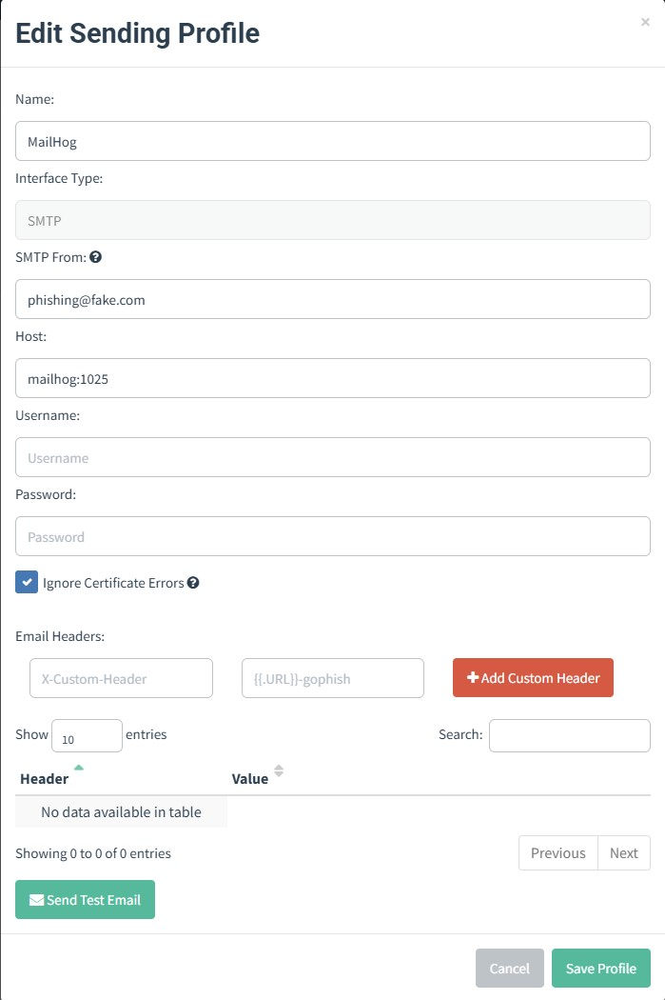

### Users and Groups
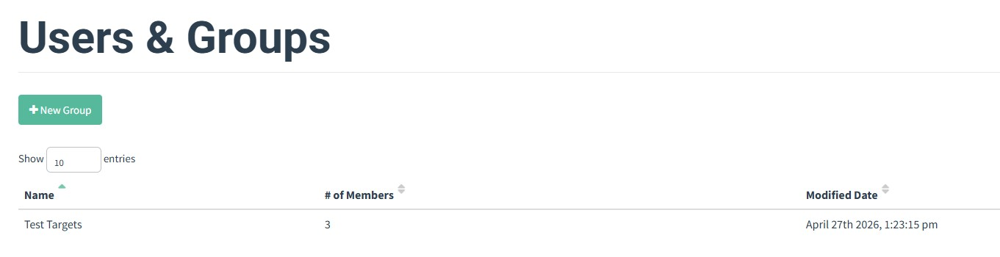

### Users in Test Targets Group
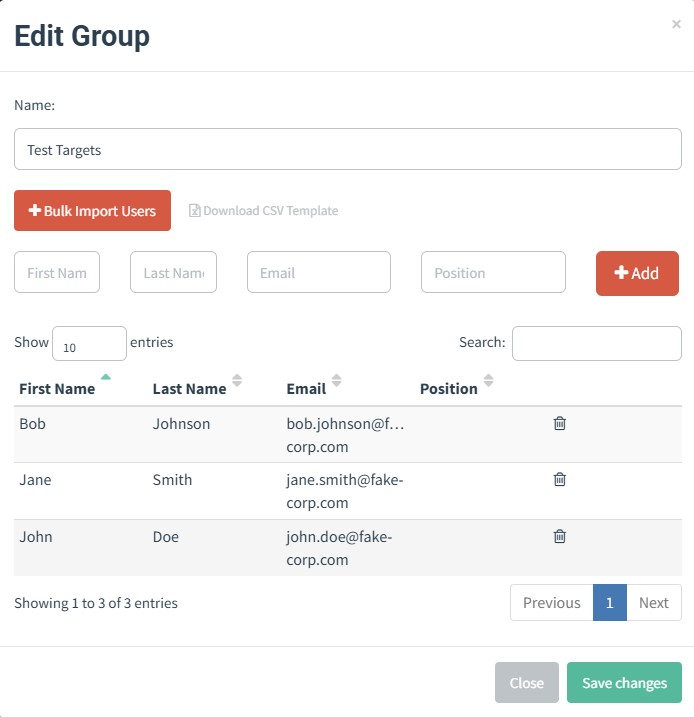

### Fake Landing Page
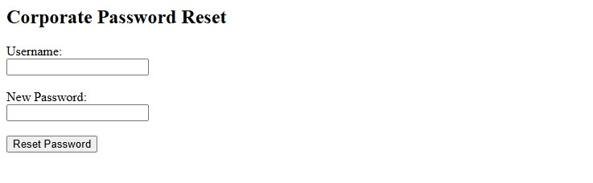

### MailHog Dashboard
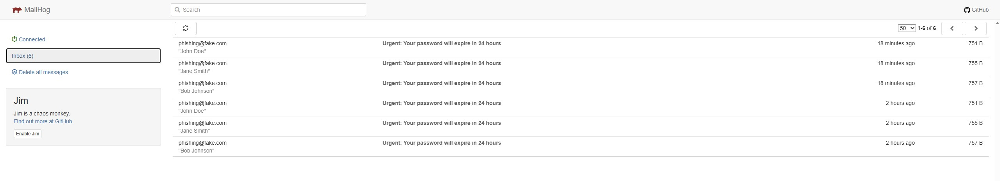

### MailHog Received Email
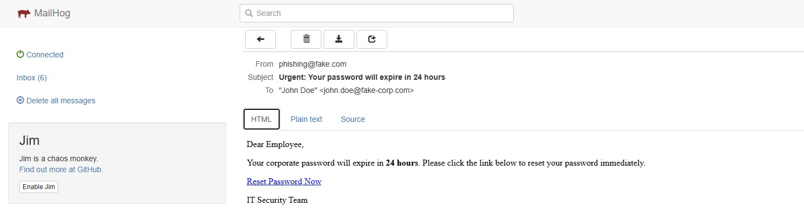
